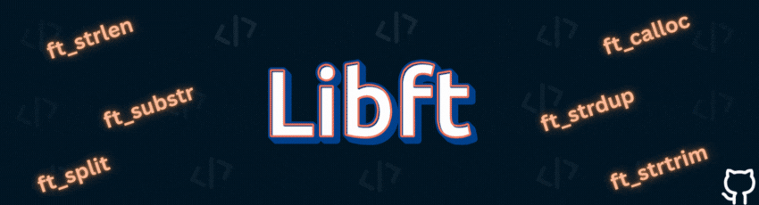

# Libft - Building the Foundation

## 📋 Table of Contents

- [IMPORTANT Notice](#important-notice)
- [What is Libft?](#what-is-libft)
- [What benefits do we get from doing the Libft project?](#what-benefits-do-we-get-from-doing-the-libft-project)
- [Function Reference](#function-reference)
  - [Part 1: Libc Functions](#part-1-libc-functions)
    - [Character Classification and Conversion](#character-classification-and-conversion)
    - [String Functions](#string-functions)
    - [Memory Functions](#memory-functions)
    - [Conversion and Allocation](#conversion-and-allocation)
  - [Part 2: Additional Functions](#part-2-additional-functions)
    - [String Processing](#string-processing)
    - [File Descriptor Output](#file-descriptor-output)
  - [Bonus: Linked List Functions](#bonus-linked-list-functions)
- [Understanding Memory Management: Stack vs Heap](#understanding-memory-management-stack-vs-heap)
  - [The Stack: Automatic Memory Management](#the-stack-automatic-memory-management)
  - [The Heap: Dynamic Memory Management](#the-heap-dynamic-memory-management)
  - [What is Memory Allocation?](#what-is-memory-allocation)
  - [Why Do We Allocate Memory?](#why-do-we-allocate-memory)
  - [What is a Memory Leak?](#what-is-a-memory-leak)
  - [Best Practices for Memory Management](#best-practices-for-memory-management)
- [Compilation Process Overview](#compilation-process-overview)
  - [Visual Compilation Flow](#visual-compilation-flow)
  - [The 4 Main Phases](#the-4-main-phases)
  - [Simple Commands](#simple-commands)
- [Makefile Simplified](#makefile-simplified)
  - [Key Variables](#key-variables)
  - [Important Rules](#important-rules)
  - [How Make Decides What to Build](#how-make-decides-what-to-build)
  - [Example Build Sequence](#example-build-sequence)

---

## IMPORTANT Notice
> ***"Don't try to validate the project too quickly and skip the low-level concepts that must to know, because you'll face many problems in future projects. Take your time to learn and understand how things work."***

## What is Libft?

Libft is the gateway project of 1337 Coding School - your first real dive into the world of C programming. Think of it as building your own toolkit, crafting each tool by hand to understand exactly how it works. Instead of relying on the standard library functions that C provides, you'll recreate them from scratch, gaining invaluable insights into memory management, string manipulation, and the intricate workings of low-level programming.

## What benefits do we get from doing the Libft project?

at 1337, you can't use most standard library functions in your projects. that's why we build our Toolkit that we will use in future project. By implementing these functions yourself, you:

- Understand exactly what happens when you call a function
- Learn to think about edge cases and error handling
- Develop a keen sense for memory management
- Build confidence in your problem-solving abilities

---

## Function Reference

### Part 1: Libc Functions

#### Character Classification and Conversion

| Function | Prototype | Description | Return Value |
|----------|-----------|-------------|--------------|
| `ft_isalpha` | `int ft_isalpha(int c)` | Checks if character is alphabetic (a-z, A-Z) | 1 if true, 0 if false |
| `ft_isdigit` | `int ft_isdigit(int c)` | Checks if character is a digit (0-9) | 1 if true, 0 if false |
| `ft_isalnum` | `int ft_isalnum(int c)` | Checks if character is alphanumeric | 1 if true, 0 if false |
| `ft_isascii` | `int ft_isascii(int c)` | Checks if character is valid ASCII (0-127) | 1 if true, 0 if false |
| `ft_isprint` | `int ft_isprint(int c)` | Checks if character is printable (including space) | 1 if true, 0 if false |
| `ft_toupper` | `int ft_toupper(int c)` | Converts lowercase letter to uppercase | Uppercase char or unchanged |
| `ft_tolower` | `int ft_tolower(int c)` | Converts uppercase letter to lowercase | Lowercase char or unchanged |

#### String Functions

| Function | Prototype | Description | Return Value |
|----------|-----------|-------------|--------------|
| `ft_strlen` | `size_t ft_strlen(const char *s)` | Calculates string length | Number of characters (excluding null terminator) |
| `ft_strchr` | `char *ft_strchr(const char *s, int c)` | Locates first occurrence of character in string | Pointer to first occurrence, or NULL |
| `ft_strrchr` | `char *ft_strrchr(const char *s, int c)` | Locates last occurrence of character in string | Pointer to last occurrence, or NULL |
| `ft_strncmp` | `int ft_strncmp(const char *s1, const char *s2, size_t n)` | Compares up to n characters of two strings | 0 if equal, positive if s1 > s2, negative if s1 < s2 |
| `ft_strnstr` | `char *ft_strnstr(const char *big, const char *little, size_t len)` | Locates substring with length limit | Pointer to first occurrence, or NULL |
| `ft_strlcpy` | `size_t ft_strlcpy(char *dst, const char *src, size_t size)` | Copies string with size limit, null-terminated | Length of source string |
| `ft_strlcat` | `size_t ft_strlcat(char *dest, const char *src, size_t size)` | Concatenates strings with size limit | Total length it tried to create |

#### Memory Functions

| Function | Prototype | Description | Return Value |
|----------|-----------|-------------|--------------|
| `ft_memset` | `void *ft_memset(void *s, int c, size_t n)` | Fills first n bytes with constant byte c | Pointer to memory area s |
| `ft_bzero` | `void ft_bzero(void *s, size_t n)` | Sets first n bytes to zero | None (void) |
| `ft_memcpy` | `void *ft_memcpy(void *dest, const void *src, size_t n)` | Copies n bytes from src to dest | Pointer to dest |
| `ft_memmove` | `void *ft_memmove(void *dest, const void *src, size_t n)` | Copies n bytes, handles overlapping memory | Pointer to dest |
| `ft_memchr` | `void *ft_memchr(const void *s, int c, size_t n)` | Scans first n bytes for character c | Pointer to matching byte, or NULL |
| `ft_memcmp` | `int ft_memcmp(const void *s1, const void *s2, size_t n)` | Compares first n bytes of memory areas | 0 if equal, positive if s1 > s2, negative if s1 < s2 |

#### Conversion and Allocation

| Function | Prototype | Description | Return Value |
|----------|-----------|-------------|--------------|
| `ft_atoi` | `int ft_atoi(const char *nptr)` | Converts string to integer | Integer value |
| `ft_calloc` | `void *ft_calloc(size_t nmemb, size_t size)` | Allocates and zeros memory for array | Pointer to allocated memory, or NULL |
| `ft_strdup` | `char *ft_strdup(const char *s)` | Creates duplicate of string | Pointer to new string, or NULL |

### Part 2: Additional Functions

#### String Processing

| Function | Prototype | Description | Return Value |
|----------|-----------|-------------|--------------|
| `ft_substr` | `char *ft_substr(char const *s, unsigned int start, size_t len)` | Extracts substring from string | New substring, or NULL |
| `ft_strjoin` | `char *ft_strjoin(char const *s1, char const *s2)` | Concatenates two strings into new string | New combined string, or NULL |
| `ft_strtrim` | `char *ft_strtrim(char const *s1, char const *set)` | Removes specified chars from beginning and end | Trimmed string copy, or NULL |
| `ft_split` | `char **ft_split(char const *s, char c)` | Splits string by delimiter into array | Array of strings (NULL-terminated), or NULL |
| `ft_itoa` | `char *ft_itoa(int n)` | Converts integer to string | String representation, or NULL |
| `ft_strmapi` | `char *ft_strmapi(char const *s, char (*f)(unsigned int, char))` | Applies function to each character with index | New transformed string, or NULL |
| `ft_striteri` | `void ft_striteri(char *s, void (*f)(unsigned int, char*))` | Applies function to each character in place | None (void) |

#### File Descriptor Output

| Function | Prototype | Description | Return Value |
|----------|-----------|-------------|--------------|
| `ft_putchar_fd` | `void ft_putchar_fd(char c, int fd)` | Outputs character to file descriptor | None (void) |
| `ft_putstr_fd` | `void ft_putstr_fd(char *s, int fd)` | Outputs string to file descriptor | None (void) |
| `ft_putendl_fd` | `void ft_putendl_fd(char *s, int fd)` | Outputs string + newline to file descriptor | None (void) |
| `ft_putnbr_fd` | `void ft_putnbr_fd(int n, int fd)` | Outputs integer to file descriptor | None (void) |

### Bonus: Linked List Functions

#### Structure Definition
```c
typedef struct s_list
{
    void            *content;    // Can hold any type of data
    struct s_list   *next;      // Points to the next element
}                   t_list;
```

| Function | Prototype | Description | Return Value |
|----------|-----------|-------------|--------------|
| `ft_lstnew` | `t_list *ft_lstnew(void *content)` | Creates new list element | New element, or NULL |
| `ft_lstadd_front` | `void ft_lstadd_front(t_list **lst, t_list *new)` | Adds element at beginning of list | None (void) |
| `ft_lstadd_back` | `void ft_lstadd_back(t_list **lst, t_list *new)` | Adds element at end of list | None (void) |
| `ft_lstsize` | `int ft_lstsize(t_list *lst)` | Counts elements in list | Number of elements |
| `ft_lstlast` | `t_list *ft_lstlast(t_list *lst)` | Returns last element of list | Last element, or NULL if empty |
| `ft_lstdelone` | `void ft_lstdelone(t_list *lst, void (*del)(void*))` | Deletes one element with custom deletion | None (void) |
| `ft_lstclear` | `void ft_lstclear(t_list **lst, void (*del)(void*))` | Deletes all elements | None (void) |
| `ft_lstiter` | `void ft_lstiter(t_list *lst, void (*f)(void *))` | Applies function to each element | None (void) |
| `ft_lstmap` | `t_list *ft_lstmap(t_list *lst, void *(*f)(void *), void (*del)(void *))` | Creates new list by applying function | New list, or NULL |

---
For More Informatins You can check the [Manual](https://www.die.net/) and search for the function you want !

## Understanding Memory Management: Stack vs Heap

As you work with Libft, especially functions like `ft_calloc`, `ft_strdup`, and the linked list operations, you'll be dealing with different types of memory.

### The Stack: Automatic Memory Management

The **stack** is a region of memory that stores local variables, function parameters, and return addresses.

#### Stack Characteristics:
- **Automatic management:** Memory is automatically allocated when entering a function and freed when exiting
- **Fast access:** Stack operations are very fast (just moving a pointer)
- **Limited size:** Usually 1-8MB depending on system configuration
- **Organized:** Memory is allocated in a predictable, sequential manner

#### Example of Stack Usage:
```c
void stack_example(void)
{
    int local_var = 1337;        // Stored on stack
    char buffer[100];          // Array stored on stack
    char *ptr;                 // Pointer stored on stack (but what it points to might be elsewhere)

    // When function ends, all stack memory is automatically freed
}
```

### The Heap: Dynamic Memory Management

The **heap** is a region of memory used for dynamic allocation. Unlike the stack, you explicitly control when memory is allocated and freed.

#### Heap Characteristics:
- **Manual management:** You must explicitly allocate (`malloc`) and free (`free`) memory
- **Flexible size:** Can grow as needed (depending on your RAM Size)
- **Slower access:** Allocation/deallocation involves more complex operations
- **Unorganized:** Memory can be allocated and freed in any order, leading to fragmentation

#### Example of Heap Usage:
```c
void heap_example(void)
{
    // Allocate memory on heap
    char *dynamic_string = malloc(50 * sizeof(char));
    int *numbers = calloc(10, sizeof(int));

    // Use the memory...
    ft_strcpy(dynamic_string, "Hello, heap!");
    numbers[0] = 1337;

    // MUST free the memory when done
    free(dynamic_string);
    free(numbers);
}
```

### What is Memory Allocation?

**Memory allocation** is the process of reserving a block of memory for your program to use. In C, you have two main types:

#### 1. Static/Automatic Allocation (Stack)
```c
int array[100];           // Compile-time size, stack allocated
char buffer[256];         // Size known at compile time
```

#### 2. Dynamic Allocation (Heap)
```c
int *array = malloc(100 * sizeof(int));     // Runtime size, heap allocated
char *buffer = calloc(256, sizeof(char));   // Zeroed memory allocation
```

### Why Do We Allocate Memory?

#### 1. **Variable Size Requirements**
Sometimes you don't know how much memory you need until runtime:
```c
// User inputs the size
printf("How many numbers? ");
scanf("%d", &count);
int *numbers = malloc(count * sizeof(int));  // Size determined at runtime
```

#### 2. **Large Data Structures**
Stack has limited space. Large arrays need heap allocation:
```c
// This might cause stack overflow:
int huge_array[1000000];  // Too big for stack

// This is safer:
int *huge_array = malloc(1000000 * sizeof(int));  // Allocated on heap
```

#### 3. **Persistent Data**
Data that needs to survive beyond function scope:
```c
char *create_string(void)
{
    char local[100] = "Hello";     // Dies when function ends
    char *heap_str = malloc(100);  // Survives function exit
    strcpy(heap_str, "Hello");
    return heap_str;               // Caller must free this!
}
```
### What is a Memory Leak?

A **memory leak** occurs when dynamically allocated memory is not freed, causing your program to consume more and more memory over time.

#### Example of Memory Leak:
```c
void leaky_function(void)
{
    char *str = malloc(100);
    strcpy(str, "This memory will leak!");

    // Function ends without calling free(str)
    // The memory remains allocated but unreachable
    // This is a memory leak!
}
```

#### How Memory Leaks Happen:

1. **Forgetting to free:**
```c
char *data = malloc(1000);
// ... use data ...
// Oops! Forgot free(data);
```

2. **Early returns:**
```c
char *process_data(int error_condition)
{
    char *buffer = malloc(500);

    if (error_condition)
        return NULL;  // Leaked buffer!

    // ... process ...
    free(buffer);
    return result;
}
```

3. **Lost pointers:**
```c
char *ptr = malloc(100);
ptr = malloc(200);  // Lost reference to first allocation!
```

#### Preventing Memory Leaks:

1. **Every malloc needs a free:**
```c
char *data = malloc(100);
if (data) {
    // ... use data ...
    free(data);        // Always free
    data = NULL;       // Prevent accidental reuse
}
```

2. **Free in all code paths:**
```c
char *process_data(int error_condition)
{
    char *buffer = malloc(500);
    if (!buffer)
        return NULL;

    if (error_condition) {
        free(buffer);  // Free before early return
        return NULL;
    }

    // ... process ...
    free(buffer);      // Free in normal path
    return result;
}
```

3. **Use tools to detect leaks:**
```bash
# Valgrind - memory error detector
valgrind --leak-check=full ./your_program

# Example output for a leak:
# ==12345== 100 bytes in 1 blocks are definitely lost in loss record 1 of 1
# ==12345==    at 0x4C2AB80: malloc (in /usr/lib/valgrind/vgpreload_memcheck-amd64-linux.so)
# ==12345==    by 0x400537: main (test.c:10)
```

### Best Practices for Memory Management

1. **Initialize pointers:**
```c
char *ptr = NULL;  // Always initialize
```

2. **Check allocation success:**
```c
char *data = malloc(100);
if (!data) {
    // Handle allocation failure
    return ERROR;
}
```

3. **Free and nullify:**
```c
free(ptr);
ptr = NULL;  // Prevent double-free
```

4. **Match every malloc with free:**
```c
// Good pattern:
char *create_and_process(void)
{
    char *buffer = malloc(256);
    if (!buffer)
        return NULL;

    // ... process ...

    free(buffer);
    return result;
}
```

5. **Use valgrind regularly:**
```bash
valgrind --leak-check=full --track-origins=yes ./your_program
```
---

## Compilation Process Overview

The compilation process transforms your C source code into a usable library. Here's a simplified overview:

### Visual Compilation Flow
```text
  Build process for Libft

	.c (source)     →   .i (preprocessed)   →   .s (assembly)   →   .o (object)   →   libft.a (library)

	ft_strlen.c     →   ft_strlen.i         →   ft_strlen.s     →   ft_strlen.o   →   libft.a
	ft_strchr.c     →   ft_strchr.i         →   ft_strchr.s     →   ft_strchr.o   →   libft.a
	ft_memset.c     →   ft_memset.i         →   ft_memset.s     →   ft_memset.o   →   libft.a
	...             →   ...                 →   ...             →   ...           →   libft.a

  Human-readable C code   →   Expanded macros/includes   →   Assembly instructions
                          →   Machine code (object)      →   Static library (ready to use)
```

### The 4 Main Phases

#### 1. **Preprocessing** (`cc -E`)
- Includes header files (`#include`)
- Expands macros (`#define`)
- Removes comments
- Handles conditional compilation (`#ifdef`)

#### 2. **Compilation** (`cc -S`)
- Parses C syntax
- Checks for errors
- Optimizes code
- Generates assembly code

#### 3. **Assembly** (`cc -c`)
- Converts assembly to machine code
- Creates object files (`.o`)
- Includes symbol tables

#### 4. **Linking** (`ar rcs`)
- Combines all object files
- Creates static library (`libft.a`)
- Resolves symbol references

### Simple Commands
```bash
# Compile everything
make

# Compile with bonus
make bonus

# Clean object files
make clean

# Clean everything
make fclean

# Rebuild from scratch
make re
```

---

## Makefile Simplified

Your Makefile automates the compilation process. Here are the key concepts:

### Key Variables
```makefile
SRCS = ft_strlen.c ft_strchr.c ...    # List of source files
OBJS = ${SRCS:.c=.o}                  # Converts .c to .o automatically
CC = cc                               # Compiler
CFLAGS = -Wall -Wextra -Werror        # Compilation flags
NAME = libft.a                        # Final library name
```

### Important Rules

#### **Pattern Rule** - The Magic Behind Compilation
```makefile
%.o: %.c libft.h
	${CC} ${CFLAGS} -c $< -o $@
```
**Translation:** "To make any `.o` file, take the corresponding `.c` file and header, then compile with flags"

#### **Library Creation**
```makefile
${NAME}: ${OBJS}
	ar rcs ${NAME} ${OBJS}
```
**Translation:** "To make `libft.a`, collect all object files and archive them"

#### **Cleanup Rules**
```makefile
clean:
	rm -f *.o

fclean: clean
	rm -f ${NAME}

re: fclean all
```
**Translation:**
- `clean` = remove object files
- `fclean` = clean + remove library
- `re` = clean everything + rebuild

### How Make Decides What to Build

Make compares **timestamps**:
- If source file is newer than object file → Recompile
- If header file is newer than object file → Recompile
- If any object file is newer than library → Rebuild library
- If everything is up-to-date → Do nothing

### Example Build Sequence
```bash
$ make
cc -Wall -Wextra -Werror -c ft_strlen.c -o ft_strlen.o
cc -Wall -Wextra -Werror -c ft_strchr.c -o ft_strchr.o
# ... compile all files ...
ar rcs libft.a ft_strlen.o ft_strchr.o ... # create library
```

---

## ⭐ Support This Project

If you found this README helpful and it made your Libft journey easier, **don't forget to star the repository!** ⭐

Your star helps other 42 students discover this resource and motivates continued improvement of the documentation.

**[⭐ Star this repository](https://github.com/MXCALLL/Libft)**

---
